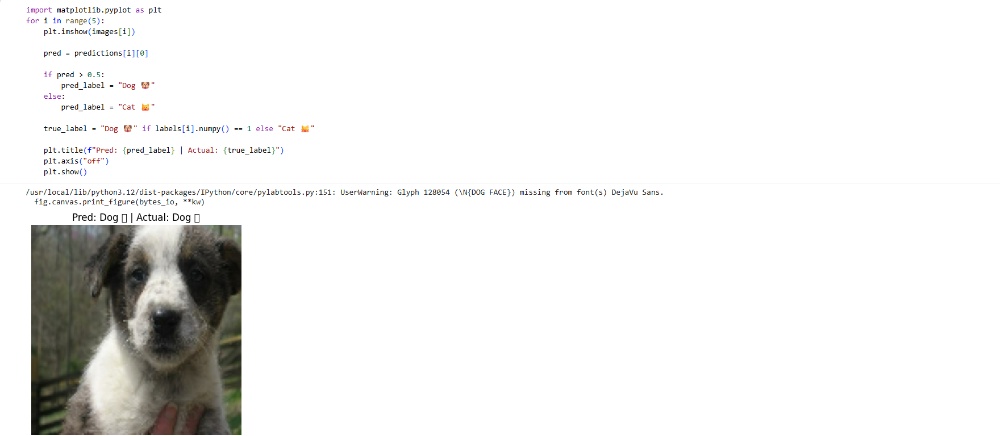
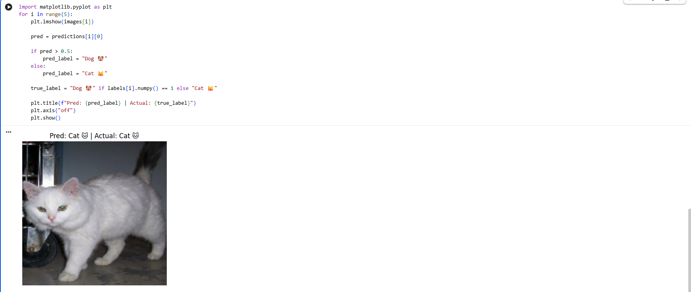
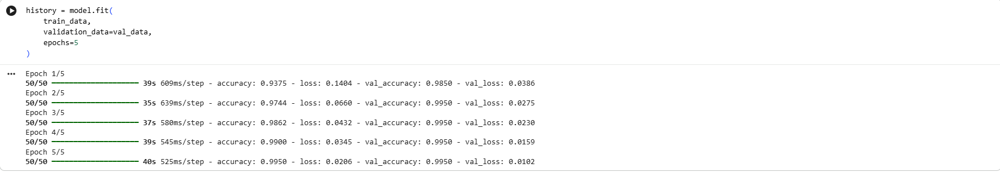

# 🐶🐱 Dog vs Cat Classifier (Deep Learning Project)

This is a deep learning project that classifies images of dogs and cats using **Transfer Learning (MobileNetV2)** with TensorFlow.

---

## 🚀 Project Overview

The goal of this project is to build an image classification model that can distinguish between cats and dogs using a Convolutional Neural Network (CNN) based on a pre-trained MobileNetV2 model.

---

## 🧠 Tech Stack

- Python 🐍
- TensorFlow / Keras
- TensorFlow Datasets (TFDS)
- NumPy
- Matplotlib
- MobileNetV2 (Transfer Learning)

---

## 📊 Dataset

- Dataset: `cats_vs_dogs` from TensorFlow Datasets
- Images: Dogs 🐶 and Cats 🐱
- Image size: 128 x 128
- Total used: 2000 images (for training + testing split)

---

## 🏗️ Model Architecture

- Pretrained Model: MobileNetV2 (ImageNet weights)
- Frozen base layers (no retraining)
- Custom layers added:
  - Global Average Pooling
  - Dense layer (128 neurons, ReLU)
  - Dropout (0.3)
  - Output layer (Sigmoid activation)

---

## ⚙️ Training Details

- Optimizer: Adam
- Loss Function: Binary Crossentropy
- Epochs: 5
- Batch Size: 32
- Validation Split included

---

## 📁 Project Structure
dog-vs-cat-classifier/
│
├── train.py # Training script
├── predict.py # Prediction script
├── requirements.txt # Dependencies
├── README.md # Documentation
└── model/
└── dog_cat_model.h5 # Trained model


---

## ▶️ How to Run the Project

### 1️⃣ Install dependencies
```bash
pip install -r requirements.txt

2️⃣ Train the model

python train.py

3️⃣ Run predictions
python predict.py

💾 Model Output

After training, the model will be saved at:

model/dog_cat_model.h5


📌 Results
## 📸 Results

### 🐶 Dog Prediction


### 🐱 Cat Prediction


### 📊 Training Output


👨‍💻 Author

ARYAN HARSH

